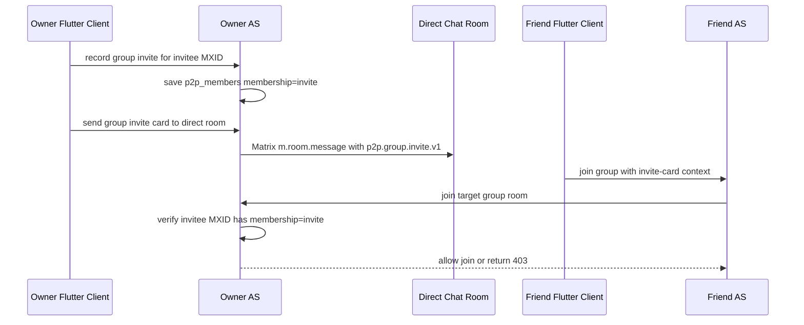

# Group Invite Card Design

Date: 2026-06-20

## Goal

Inviting friends into an existing group should work like channel share cards in the chat UI: the inviter selects friends, each friend receives a small card in the direct chat, and the friend can tap the card to join without a separate owner approval step.

The card is not a public join link. The owner node must record who was invited, and group join must be allowed only for recorded invitees.

## Current Behavior

- The Flutter client already renders `p2p.group.invite.v1` as `GroupInviteCard`.
- Tapping the card already calls `POST /_as/groups/{roomId}/join` through `joinGroupInviteThroughAs`.
- The existing group member invite UI calls `POST /_as/groups/{roomId}/invite`, which creates pending invite state instead of sending a chat-card-first experience.
- The service stores group membership/invite records in `p2p_members` through `memberRecord` and `saveMember`.
- Current `groups.join` creates or updates the joining member and does not require a prior invite record.

## Desired Behavior

1. A group owner or permitted inviter selects one or more accepted contacts from group detail/info.
2. The owner node records each selected MXID as invited for the group.
3. The client sends each selected friend a direct-chat group invite card.
4. The invited friend taps the card.
5. The friend node calls group join with the card context.
6. The owner node accepts the join only if that MXID has a valid invite record for the group.
7. Users without an invite record receive a forbidden response and cannot join through copied or forwarded cards.

## Recommended Approach

Add a card-invite path that reuses the existing member invite storage model but avoids treating the invite card as an open link.

### Backend

- Extend `rooms.send` structured message support with `message_type: group_invite`.
- Add a group invite card payload that preserves the current Matrix card contract:
  - `msgtype: p2p.group.invite.v1`
  - `group_room_id`
  - `group_name`
  - `inviter_mxid`
  - `inviter_display_name`
  - `direct_room_id`
- Add a backend path or parameter that records selected group invitees without relying on Matrix invite-room approval UX.
- Store each invite as a member record with `membership = invite`.
- Keep owner/admin permission checks consistent with the existing group invite policy.
- Change `groups.join` for group card joins so the joining MXID must already have a non-hidden invite record. Missing, removed, rejected, or banned records return `403`.
- Joining a valid invitee changes that member record to `join` and refreshes group metadata as today.

### Flutter Client

- Add an `AsClient` method for sending a group invite card through `/_as/rooms/{directRoomId}/send`, following the existing `sendChannelShareMessage` pattern.
- Change `showInviteGroupMembersFlow` so the selected contacts are recorded as invited and receive cards in their direct chat rooms.
- Do not fall back to the old approval flow when a direct chat room is missing. Report skipped/failed recipients to the inviter.
- Keep `GroupInviteCard` rendering and `joinGroupInviteThroughAs` as the receiver-side UI path.
- Improve the receiver-side failure message for `403` to say the invite is missing or expired.

## Data Flow

## Error Handling

- No selectable contacts: keep the existing empty-state dialog.
- Selected contact has no direct room: skip and show a count in the result snackbar.
- Recording invite fails: do not send the card for that recipient.
- Card send fails after recording invite: report failure; the invite record may remain valid so a retry can send another card.
- Receiver join returns `403`: show an expired/not-invited message and keep the user in the current chat.

## Tests

Backend tests:

- `rooms.send` preserves the `group_invite` Matrix payload.
- Recording a group card invite stores `membership = invite`.
- `groups.join` rejects a user with no invite record.
- `groups.join` allows a user with a valid invite record and transitions membership to `join`.

Flutter tests:

- `HttpAsClient` posts the new group card invite payload.
- Group detail invite flow records/sends card invites instead of directly calling the old member invite path.
- Missing direct room recipients are skipped and reported.
- Group invite card join handles forbidden responses with an invite-invalid message.

## Documentation

- Update `docs/FEATURES.md` to describe card-based group invitation.
- Update `docs/AS_API_CHANGES.md` if the AS contract adds a new endpoint, request field, or stricter `groups.join` validation.
